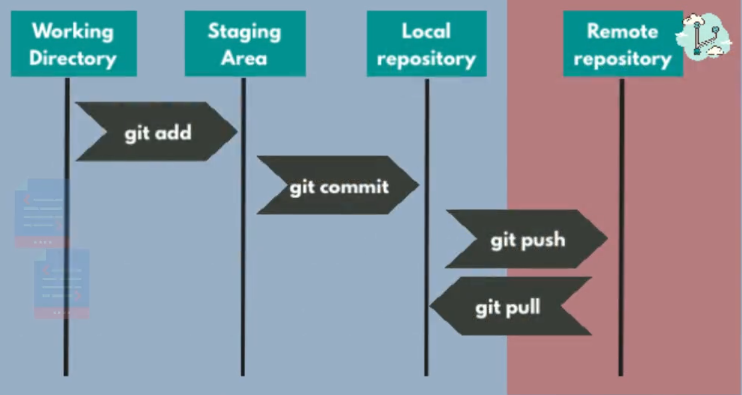

# 3. Version Control with Git (module 3/16)

## Module Overview

In this module, we'll learn about "version control" and its most popular implementation: Git.  
Version control is used in software development to track and manage changes to source code over time.  

It's becoming more and more important in the DevOps space in order to manage the application configuration 
as part of the infrastructure as code (IaC) concept.  

As a DevOps engineer, we need to know how to use Git.  

---

## What is Version Control?

- Multiple developers are working on the same project, they need a place to **share** their work.  
- The code needs to be hosted **centrally** on the Web.  
- The place where code lives on the Web is called a "**repository**".
- Every developer has a **local copy** of the repository.
- We **fetch** the code from the repository to our local machine.
- We make some changes and then **push** those changes back to the repository.
- The next developer can then **pull** the changes from the repository and merge them into their local copy.
- They make some changes and then **push** those changes back to the repository.
- The process repeats until all the developers have pushed their changes to the repo
- This process is called **version control**.

---

## Merging & Conflicts

What happens when you and some other dev change the same files?  
>Git knows how to merge changes automatically

But what happens if you edit files for days while someone changes the same files in a completely different direction?  
>Git will **conflict**, changes are so different that Git is not able to sort this out  

In case of conflicts, you need to resolve them manually with the developer who has changed the same files as you.  
And that can be very tedious...  

Because of that, the best practice is to push and pull code as often as possible.  
This way, Git doesn't have to merge huge changes that overlap too much.  
This is called **Continuous Integration (CI)**.  

---

## Breaking changes

What happens if someone messes up and pushes changes that break the application?  

When someone pushes their breaking changes to the repo, it doesn't affect you until you pull these changes.  
Because you're working with your local copy of that repo.  

Once you pull those changes, your code includes the breaking changes too.  
But no need to panic, version control keeps the history of the changes to the repo.  

Every code change in every file is tracked in Git.  
Every commit made by other members of your team is a new history item.  

You can revert the commits, or simply go back to a previous version of the repository anytime.  
Hence the name "version control"...  

As the project moves forward, you don't have to worry about losing track of what changes have happened.  
Also, each change is labelled with commit messages, so you also know why such changes were made.  

Which is why your commits shouldn't be too large.  
First of all, this will make it easier to revert changes.  
And second, it's easier to describe small changes with a commit message.  

---

## Basic concepts of Git

Git is the most popular version control system. Alternative tools exist, such as SVN, for example.  
The inventor of Git is Linus Torvalds, the same person who created the Linux kernel.  

Git has multiple parts:
- the remote Git repository: where the code lives
- the UI (user interface): for interacting with the repository
- the local Git repository: where you store your local copy of the code
- the history of code changes: git log
- the staging area : where your working changes are stored before committing them to the remote repo
- the Git client: a UI tool or a CLI installed on your machine that lets you execute Git commands

  

---

## How to set up a Git repo (remote & local)

### Remote repo

Various online platforms can host Git repositories, the most popular ones being:
- GitHub
- GitLab

- Repositories can be public or private depending on your choice
- You have to sign up for an account on these platforms to use them
- You can do a lot via these platforms UI, pretty much everything is there 
- Some companies have their own Git servers

### Local repo

- Git client needs to be installed first: can be a UI client or Git CLI
- Git CLI requires memorizing a handful of commands
- Git client needs to be connected with remote platform, which requires authenticating to GitHub/GitLab/...
- For that, once Git has been installed, you need to configure your username and email:
```bash
git config --global user.name "<username>"
git config --global user.email "<email>"
```  

- We can also add our public SSH key to the remote platform:
  - generate an SSH key pair on your local machine if you don't have one
  - log in to the remote platform
  - go to Settings -> SSH keys
  - add your public key
Once we've added our public key to the remote platform, it can authenticate us when pushing to or pulling from repo.  

After you've installed and configured the Git client, you can create a local repo:
- you can either clone an already existing remote repo: `git clone <url>`
- Or create a brand new local repo via the `git init` command

If you create a brand new repo, it will be empty at first, except for the `.git` folder.  
This folder contains information about the repo, such as the history of commits, the configuration, etc.  

---

## Working with files in Git

It's important to know the status a file can have in Git: 
- modified: when you make changes to a staged file
- untracked: when you create a new file
- **staged**: when you add a file to the staging area via `git add`
- **committed**: when you commit your changes via `git commit`
- **pushed**: when you push your changes to the remote repo via `git push`

The steps to work with files in Git are:
1. Create and edit a file
2. Add the file to the staging area
3. Commit changes to the local repo
4. Push changes to the remote repo

To get the status of your local git repo, run `git status`  
This will show you which branch you're on, your untracked files, your commits and changes to be committed.  

At first, your files are in the "working directory".  
If you use the `git add` command on these files, they will be moved to the staging area.  

To stage all untracked files/changes in the current folder, run `git add .`  
To stage a specific file, run `git add <file_name>`  
To unstage a file, run `git rm --cached <file_name>`  

Staged files are ready to be committed.  
If you modify a staged file, changes won't be part of the next commit, they will be unstaged.  
To discard changes in the working directory, run `git restore <file_name>`  

To commit your changes to the local repo, run `git commit -m "<message>"`  
Committing is confirming that you want to save your currently staged changes to the local repo.  
The history of your commits can be seen with `git log`  

**Recap**:  
working directory > staging area > local repo > remote repo  

Finally, to save changes to the remote repo, run: `git push`  

---

## Initializing a Git project locally

Sometimes you won't be cloning an existing Git repository.  
Instead, you'll be creating a new project from scratch.  
And once you decide to work with Git on this project, you'll need to initialize a local Git repo.  

You do that by running the `git init` command.  
This will create a new local repo, which you can then configure to point to a remote repo.  

I can stage all files via `git add .`  
I can commit all staged files via `git commit -m "<message>"`  

### Connecting a local repo to a remote repo

At this point, our local repo isn't connnected to any remote repo.  
We need to go to GitLab or GitHub to create a new empty project.  

Then, we need to copy our remote repo's URL.  
And finally, we can run `git remote add origin <url>` to connect the local repo to the remote repo.  

This last command tells my local repo where to push the changes to.  

Now, I can run `git push` to push my changes to the remote repo.  
But I'll get an **error** because repos are connected but not **branches**.  

### Connecting branches

We have to connect the main branch of our local repo to the main branch of our remote repo.  
This is done via `git push --set-upstream origin main`  

>[!note]
>Older repos might not have a "main" branch.  
>Instead they have a "master" branch.  

### The .git folder holds the configuration of the repo

The last two commands, `git remote add origin <url>` and `git push --set-upstream origin main`, 
modified the configuration of our Git repo and generated information that is stored in the `.git` folder.  

This folder stores the information about how to connect to the remote repo, where is the remote, which endpoint, 
and how the branches actually connect to each other.  

---

## Concept of Branches

master branch = main branch  
This is the branch that is created by default when initializing a Git repo  
Git stopped using the "master" word around 2020.  

Typical use case in a development team is:
- developing new features for an application
- fixing bugs in existing features

We said it's important to commit changes often and in small chunks to the main branch in the repo.  
Imagine what a mess the repo would be if all developers pushed their changes to the same branch...  

No one would know the actual state of the repo:
- Are the bugs fully fixed? 
- Are the new features fully implemented?

No one could tell when the repo is in a state where you can build the application and deploy it somewhere.  
The concept of branches exists in order to cleanly divide the work of different developers.  

Best practice is to create a branch for each feature and each bug fix.  
The naming standard is `feature/<feature_name>` or `bugfix/<bugfix_name>`  

This way, each dev can commit its half done or work in progress changes as often as they want without 
breaking other people's code.  

And once fully implemented and tested locally, a dev can say "my feature/bugfix is ready to be merged into the main branch".  
That's what we call a "**merge request**".  

>[!important]  
>Large feature branches that are open for too long increase the chance of merge conflicts.  
>That's why it's important to have small features that don't take weeks to implement.  
>Otherwise, developers will have to communicate and solve merge conflicts all the time...  

Using branches allows us to always have a stable main branch.  
Because we don't merge into the main branch until the feature/bugfix is ready.  

### Creating a new branch

2 ways:
- via the Git platform UI (GitHub/GitLab)
- via the `git checkout -b <branch_name>` command

#### Using the UI

It's best practice to create the new branch from the main one.  

To start working on the new branch, I have to tell my local repo.  
- To show all branches, run `git branch`  
- To inform my local repo about the new branch, run `git pull`  
- To switch to the new branch, run `git checkout <branch_name>`

#### Using the command line (faster)

- first, make sure you're on the main branch: run `git checkout main` if not
- then, create the new branch and switch to it: `git checkout -b <branch_name>`

This creates a branch locally, one that is based on the main branch.  
To inform the remote repo about the new branch: `git push --set-upstream origin <branch_name>`  
Now the branch should be visible in the remote repo.  

>[!tip]
>We don't have to memorize all these commands.  
>For example, when we simply run `git push`, we get a suggestion of the command to use.  
>Git is smart enough to understand what we want to do, and helps us with appropriate suggestions.  

What matters here is to keep in mind that we need to align our local repo with the remote one, and vice versa.  

### main and develop branches

A lot of projects actually have 2 main branches:
- **main**
- **develop**

The "**dev**" branch represents an **intermediary** step before the code is merged into the main branch.  
The main branch represents the **final** version of the code.  

The main branch is used for **releases** in **production**, while the develop branch is used for **testing/staging** environments.  

During what's called a "**sprint**", features and bug fixes are implemented and then merged into the develop branch.  
Once the sprint is over, the develop branch is merged into the main branch, and the main branch is "**released**".  

### Trunk based vs Feature based development

#### Trunk based development (only main branch)

- better for CI/CD (continuous integration/continuous delivery) pipeline
- pipeline is triggered every time a feature/bugfix code is merged into the main branch
- a CI/CD pipeline tests the code, builds the application, and deploys it to the staging/production environment

#### Feature based development (additional dev branch)

- many features and bugfixes are collected in the dev branch
- that big chunk of changes is merged into the main branch at the end of the sprint
- releases happen less often and require developers to carefully synchronize when it's time to merge dev into main

>[!important]
>The best practice in DevOps, the modern way of working, is to use trunk based development.  
>But as DevOps engineers, it's also important to know that some teams use feature based development.  
>Different companies have different Git workflows, some even have a third branch (staging or test branch).  

But the ideal goal remains to only have one main branch, and to build and deliver changes after every merge into the main branch.  

---

## Merge Requests

When a dev is done with a feature implementation or bug fix, another dev reviews the changes before merging them into the main branch.  
That's considered best practice, especially when coding a big feature or when job was assigned to a junior dev.  

When a dev submits code for review, we call that a **merge request** (GitLab), or a **pull request** (GitHub).  
If this dev knows someone in their team that has expertise in the relevant area, they can assign the merge request to that person.  

The code reviewer can either approve or decline the merge request.  
If the request is declined, they usually provide comments so the other dev can learn from their mistakes.  
If the request is approved, the code is merged into the main branch.  

---

## Deleting branches

What to do with a branch once it's been merged into the main branch?  
The best practice is to delete it right after merging.  

If that new code contains bugs, we should create a bugfix branch.  
If it requires some additional work to further improve the feature, we should create a feature branch.  

The advantage of deleting branches after merging into main is that you don't end up with hundreds of branches, 
where nobody knows which one is active, which one is completed, or which one has been merged into the main branch.  

Deleting branches in the remote repo is easy, the UI makes it very straightforward.  

To delete branches locally:
- `git branch` to see all branches
- `git checkout main` to switch to main branch
- `git pull` to update the local repo with latest changes
- `git branch -d <branch_name>` to delete the merged branch

---

## Rebase

Let's imagine we have 2 developers working on the same feature/bugfix branch.  
One of them pushes their changes to the remote repo.  
When the other one tries to push their changes to the remote, he will get an error:  
"Updates were rejected because the remote contains work that you do not have locally..."  

Since the local repo is out of sync with the remote one, we need to first integrate the remote changes before pushing.  

Option 1 is to pull the remote changes first: `git pull` and then push our changes: `git push`  
But the issue with that method is that it will pollute the repo history with "merge commits" for every pull request.  

Option 2 is to use `git pull -r` or `git pull --rebase`.  
It pulls the changes from remote branch, and then stacks our changes on top of them.  
Then, we can run `git push` to push our changes to the remote repo.  
This way, there is no merge commit in between the pull and push commands.  

Option 2 is best practice, as it will result in a much cleaner project history.  

To explain it differently:  
`git pull --rebase` updates your branch by fetching remote changes first, then replays your local commits on top of 
the remote commits instead of creating a merge commit.  

---

## Resolving merge conflicts

Suppose we make some changes to a specific line in one file in our local repo.  
We then stage those changes and commit them locally.  

Then, someone else makes changes to the same line in the same file in their local version of the repo, and pushes those 
changes to the remote. Their changes differ from ours and we now have a merge conflict.  

If we run `git pull -r`, we'll get an error message because of the merge conflict.  
Git cannot know which changes should be kept and which should be discarded.  

In such cases, you need to talk with the other dev in order to manually resolve the merge conflict.  
In real life, you'll probably need to resolve merge conflicts on multiple files.  

To resolve merge conflicts, run `git status` to first identify conflicted files.  
Then, open these files one by one in your code editor, using the source control view.  
You'll usually have 3 views: your changes, the desired end result, and the other dev's changes.  

Once you're done resolving conflicts, you can run `git rebase --continue` followed by `git push`.  

---

## .gitignore file

Whenever developers create a project, they initiate it as a Git repo.  
To specify which files should not be tracked, we add a `.gitignore` file to the root of the repo.  

Folders and files listed in the `.gitignore` file will not be tracked by Git.  
For instance, we don't want to track the `node_modules` folder in a Node.js project.  
This special folder contains the app's dependencies generated when running `npm install`.  

Another example of files to exclude are the ones generated when we build an application.  

Example of a .gitignore file:
```.gitignore
.idea/*
build/*
dist/*
node_modules/*
```

### Clearing Git's cache

In case you've already pushed some excluded files or folders to the remote before creating the `.gitignore` file, 
you need to run `git rm -r --cached <file_or_folder_name>` to tell Git to stop tracking them.  

For example: `git rm -r --cached node_modules` will remove the node_modules folder and all its contents from the cache.  
The -r option stands for "recursive".  

---

## Git stash

When you have uncommited changes in a branch and you want to switch branches, Git gives you an error:  
"Your local changes to the following files would be overwritten by checkout: <file_name>  
Please commit your changes or stash them before you switch branches. Aborting"  

In such case, we can save our changes for later, and then we're allowed to switch branches:  
- `git stash` to save our changes (it hides them)
- `git checkout <target_branch>` to switch branches  

And if we want to go back to the previous branch, we can run:
- `git checkout <previous_branch>`
- `git stash pop` to retrieve the saved changes

Another use case for `git stash` is to temporarily hide changes in the current branch.  
We might wonder if we broke something due to changes we've made, and stashing our changes helps us verify that.  
If stashing our changes suddenly solves an issue, then we know those changes should not be committed...  

---

## Going back in history

For every project, Git has a history, which is the log of commits.  
You can access it via `git log`.  

Each commit has a unique identifier, which is the **commit hash**.  
This ID can be very useful in some cases.  

Each commit also has a commit message, an author and a timestamp.  

To get the commit history of a specific file, run `git log <file_name>`  

Using the commit hash, we can go back to a specific version of our project:  
`git checkout <commit_hash>`  

You'll eventually need to stash uncommitted changes before your `git checkout` command gets accepted.  

### About the "detached HEAD" state

When you run git checkout <commit_hash>, you get a message: “**You are in 'detached HEAD' state**”.  
It means Git has moved your working directory to that specific commit, but not to a branch.  

**HEAD** is Git’s pointer to “where you are” in the repo.  
Normally it points to a branch (like "main" or "feature-xyz"), and that branch points to a commit.  
In detached‑HEAD state, HEAD points directly to a commit (the one you've checked out), not to any branch.  

The message you get is just a warning that you’re not on a branch and any new commits won’t be saved.  
Most of the time, we don't want to save changes in such scenario, we just want to go back in time for testing purposes.  

However, if you do want to keep those commits, you can run:  
`git switch -b new-branch-name`  
This creates a new branch starting from the current detached commit, so your work is now safely attached to a branch.  

Applying that technique allows us to go back in time by creating a new branch that contains the desired version of our project, 
the one that matches the commit we've specified.  

### Let's do a recap of this time travel process

- run ` git log` to see the commit history, then select the desired commit and copy its hash
- run `git checkout <commit_hash>` to go back in time
  - you might need to run `git stash` in case of uncommited changes before you can run `git checkout <commit_hash>`
- run `git switch -b new-branch-name` to create a new branch that has the desired version of your project and immediately switch to it

This takes us back to the state of the application code that we had at the time of the specified commit.  

### Going back to the up-to-date state of the project

Run `git checkout <branch_name>`.  

---

## Undoing and changing commits

Let's imagine we make some changes, stage them and then commit.  
Our local repo knows about this last commit, but the remote doesn't.  
Before pushing to the remote, we realize that we made a mistake and decide to cancel the last commit.  

For that, we can run `git reset --hard HEAD~1`  
The number after the tilde `~` is the number of commits we want to go back.  

>[!tip]  
>By running `git log` before and after a `git reset`, we can see the difference.  

After running `git reset --hard HEAD~1`, the last commit is gone and our changes got reverted.  
We can check that with the `git log` and `git status` commands.  

The `--hard` flag cancels the provided number of commits and also discards correponding changes.  

---

Now, let's say we don't want to discard the changes when we cancel the commit.  
We can run `git reset --soft HEAD~1`, which will cancel the last commit but keep the changes.  

>[!note]  
>The `--soft` flag is the default, so we can actually run `git reset HEAD~1` instead.  

After running a soft reset, we can correct some of our changes, then stage and commit again.  

---

There's another way to update the last commit that I made in my local repo.  

For example, if we later decide that we want to add some changes that should belong to the previous commit, we can: 
- make those changes 
- stage them via `git add`
- and then run `git commit --amend` to update the last commit and make it include our additional changes

This doesn't create a new commit, it simply updates the last one.  

### What if we've already pushed to the remote?

How to undo the commit once we've pushed to the remote repo?  

First, we run `git reset --hard HEAD~1` to undo the last commit and the corresponding changes locally.  
Then, we run `git push --force` to apply the same changes on the remote repo.  

We have to use the `--force` flag because the local repo is now behind the remote (one commit behind).  
Running `git push` would show this message:  
"Updates were rejected because the tip of your current branch is behind its remote counterpart."  

>[!warning]  
>NEVER do this in a branch which other people are working on.  
>Make sure you're the only one working on the branch when you plan to run `git push --force`.  

### Reverting 

When working on a branch that's likely to be used by many developers, such as main or develop, 
we can't undo commits that have already been pushed to the remote by using `git reset` and `git push --force`.  

What we can use is the `git revert` command.  

Let's assume we made changes to the main branch or develop branch.  
We stage them and commit them.  
Then, we push them to the remote repo.  

The only way to undo this is by running `git revert <commit_hash>`.  
This will undo the specified commit's changes.  
The commit hash can be found via `git log` or copied from the UI.  

Finally, we need to run `git push` to update the remote repo.  
This will apply the changes to the remote.  
Note that this will not delete the reverted commit, this will add a new commit that says "Revert <previous_commit_message>".  

### Summary

- `git reset` removes the old commit and its changes
- `git revert` creates a new commit to revert the old commit's changes

---

## Merging branches

Let's say that you have a bugfix branch that has been open for some days while a lot of things have been 
merged into the main branch. So you are way behind the main branch changes in your bugfix branch.  

Let's also say that changes from other branches from other developers are needed so that you can test your bug fix.  

You want to pull the changes from the main branch to your bugfix branch.  
To do that, you first need to make sure that your local main branch is up to date:  
- `git checkout main`
- `git pull`

Then, you can switch to your bugfix branch:  
- `git checkout bugfix/<bug_name>`

And finally, you can merge the main branch into your bugfix branch:  
- `git merge main`

Now, you can test you bug fix and, if it works, you can commit and push your changes to the remote:
- `git add .`
- `git commit`
- `git push`

Once your bugfix branch has been pushed to the remote, you can go to the remote UI and make a merge/pull request 
from your bugfix branch so that it gets merged into the main branch.  

Make sure to check the box for deleting the source branch after merging.  

Someone will review the code in your bugfix branch code and approve the merge request if everything looks fine.  
This time, the code reviewer will run a `git merge` but from the UI, not from the command line.  
And it will merge the changes from your bugfix branch into the main one.  

>[!note]  
>We can merge any branch into any other branch.  
>But the standard case for using `git merge` is either merging the main branch into a feature|bugfix branch, 
>or merging the feature|bugfix branch into the main branch.

---

## Git for DevOps

For which use cases do we need Git as DevOps engineers?  

### 1. Infrastructure as code (IaC) 

For example, you're working with a dev team that is deploying their app to Kubernetes (**K8s**).  
You're responsible for creating various Kubernetes config files (**manifests**) and these files have to be managed somewhere.  
When working with K8s, you need to write some YAML files for creating volumes, deploying databases, maybe Helm charts, etc.  

In addition to that, let's say your K8s cluster is deployed on AWS.  
In order to communicate with AWS and manage your **EKS** instance (Elastic K8s Service), you need to use automation tools such 
as **Terraform** or **Ansible**.  
Which means you also need to write some Terraform and Ansible **config files**.  

Finally, you'll probably also need to write some Bash or Python **scripts** for various tasks.  

All those scripts and config files might evolve over time, so we need a way to keep track of their different versions.  
We also need a place to store them securely and where we could share them with the rest of our DevOps team.  

### 2. CI/CD Pipeline and Build Automation

The basis of build automation or CI/CD pipeline is that you:
- checkout the application code
- test the code
- build the application
- deploy the application

For that, you need to set up integration between the build automation tool and the git repo that is hosting your code.  
We'll see how to do that in the upcoming modules.  

---
End of Module 3
