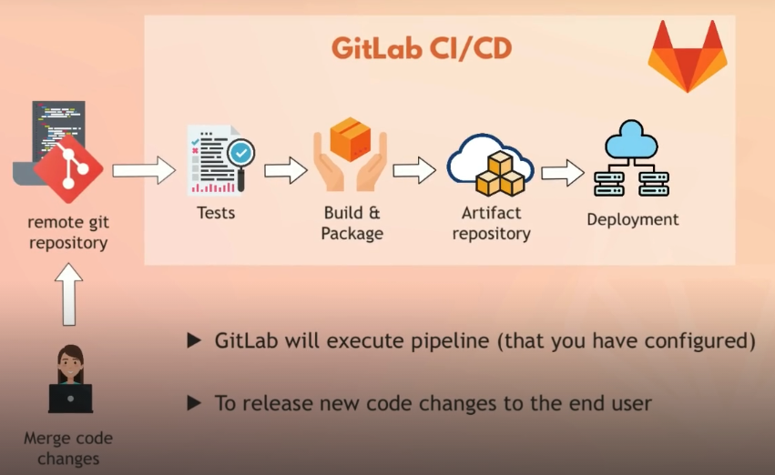

# 6. Artifact Repository Management with Nexus

## 0. Module Overview

In this module, we'll learn about artifact repositories and artifact repository managers.  

We'll set up one of the most popular artifact repo managers, Nexus, on a cloud server on DigitalOcean.  
We will then go through the most important features of Nexus:
- how to manage users and their permissions
- how to create different repositories for different artifact types
- the difference between components and assets

After setting up Nexus, we will publish a .jar file (Java app artifact) to a Maven repo on Nexus.  
First using Maven, and then using Gradle as a build tool.  

We'll also learn how to configure cleanup policies for our repositories, as well as how to talk to Nexus REST API.  

---

### DISCLAIMER

>[!important]
>Nexus will be used in Docker and Jenkins modules as well, which are modules 7 and 8.  
>This means we need to keep the droplet on Digital Ocean that runs Nexus until then, which will incur costs.  
>To reduce costs, we cannot simply stop the VM like we would do with an EC2 instance on AWS.   
>We must snapshot the Droplet, then delete it.  
>When we need it again, we can recreate a new Droplet from that snapshot.  

---

## 1. Intro to Artifact Repository Management

### Artifact Repository 

**Artifacts** are applications built into a single shareable and easily movable file.  
They can have different formats based on the language and the tools we use: .jar, .war, .zip, .tar, etc.  

An **artifact repository** = storage of those artifacts  
There are several types of artifact repositories, one for each artifact type.  

If your company builds different applications, one in Python and another one in Java, they'll need separate artifact repositories, because the artifact type will be different.  

### Artifact Repository Manager

Fortunately, we don't have to use multiple artifact repository managers depending on the artifact type.  
We can use a single artifact repository manager for all our artifact types.  

>[!important]
>An artifact repository is often abbreviated as **artifactory**.  

One of the most popular artifact repository managers is **Nexus**.  
Nexus acts as a central hub for storing and fetching all yourartifacts.  

**Nexus** is an artifactory manager that you would use internally in a company, it's for **private** use.  

There are also **public** artifactory managers, such as :
- Docker Hub, 
- Maven Central, 
- npm registry, 
- PyPI, 
- etc.  

### Private repo hosting AND Public repo proxy

On Nexus, you can host your own private repositories. It can be a Maven repo, a Dockerfile repo, an npm repo, etc.  
This way, you can share the application artifacts that are built within your company.  

But you can also set up a **proxy** on Nexus, and then fetch artifacts from **public** repositories through that proxy.  

To make it clear:
- When you deploy a private artifact, Nexus stores it in its internal storage
- When you fetch an artifact, Nexus either:
  - serves it from one of your private repositories, 
  - or routes/proxies the request to some upstream public repository, and then **caches** the response

This versatility makes Nexus very convenient because it allows us to manage all our artifacts in one spot.  

Nexus is available in two forms: open-source and commercial.  

Here's a sample of supported formats on Nexus:  
  

### Features of Artifactory Managers like Nexus

- **integrate with LDAP**: simplifies configuration of access management for big teams 
- **flexible and powerful REST API** for integration with other tools
- **backup and restore**: managing storage and data recovery
- **metadata tagging**: labelling and tagging artifacts
- **Cleanup policies**: automatically deleting old artifacts or those matching specific criteria
- **Search functionality**: searching for artifacts by name, type, and other criteria
- **user token support**: for system user authentication (non-human users)

### About the REST API

Nexus is not designed for manual management.  
It's going to be part of the whole **build automation** process and **CI/CD pipeline**.  
  

For example, when **Jenkins** builds the artifact, it needs to push it to **Nexus**.  
So we need integration between Jenkins and Nexus.  

And for automated delivery/deployment, we need to fetch artifacts from Nexus to the deployment server.  
We do that by using some script or some automated tool, which also requires integration with Nexus.  

Having a **REST endpoint** for managing artifacts is crucial because it literally sits in the **middle** of our whole 
**CI/CD pipeline**.  

>[!important]
>a REST endpoint is the URL + HTTP method combination that defines how you read, create, update, or delete data in a REST API  

### About the backup and restore feature

Nexus has its own storage mechanism configured by default.  
But it's also important to configure easy backup and restore, especially when you have a large number of artifacts.  

---

## 2. Install and run Nexus on a cloud server

### Creating the cloud server

>[!important]
>DO NOT use a VM with less resources than 4GB RAM / 2 vCPUs, as you will encounter performance issues if you do so.  

To create a droplet on DigitalOcean onto which you'll be able to install and run Nexus:
- select the region which is closest to you
- Ubuntu LTS
- Basic plan
- CPU options > Regular
- 8 GB RAM / 4 vCPUs

The current cost (May 2026) is 48$/month.  

Once the droplet is created, configure the firewall > inbound rule for allowing SSH access via port 22.  

### Installing Nexus on the cloud server

Let's SSH into our droplet: `ssh root@<IPv4_public_address>`  

>[!note]
>We previously set up a SSH key pair on our local machine, so we don't need to create a new one.  
>DigitalOcean already has the public part of the key, as we've added it to create our first droplet.  
>Refer to Module5.md for more details.  

Nexus is built using **Java**, so it is typically deployed as a Java application.  
Nevertheless, you can run Nexus on a platform that supports the JVM without having to install Java separately.  

Once logged in to the droplet, let's install Java version 17, that's the specific version that Nexus supports.  
- run `java` to see that it's not installed and get suggestions of how to install it
- copy and run the suggested command that installs Java 17
- enter the opt folder: `cd /opt`
- download Nexus package: `wget https://download.sonatype.com/nexus/3/nexus-3.91.1-04-linux-x86_64.tar.gz`
  - the latest version can be found here: https://help.sonatype.com/en/download.html
- extract the package: `tar -xvzf nexus-3.91.1-04-linux-x86_64.tar.gz`
- we now have 2 directories: `nexus-3.91.1-04` and `sonatype-work`
  - the first one contains the runtime and the Nexus application itself
  - the second one contains:
    - subdirectories depending on your Nexus config
    - IP addresses that accessed your Nexus instance
    - logs
    - your uploaded files and metadata
- The `sonatype-work` folder can be used as a backup since it contains all the config and data

>[!note]
>The latest version of Sonatype Nexus Repository (3.87.0 and later) bundles its own Java 21 runtime in official installers and Docker images, so you typically don't need to install or configure a separate Java version on your system.

### Configuring the server before running Nexus

>[!warning]
>Services should not run with root user permissions.  
>The best practice is to create a dedicated user account and run the service as that user.  

The dedicated user account should only have the necessary permissions to run Nexus and interact with it.  

To create a dedicated user account for running Nexus:
- ssh into the droplet as root
- run `adduser nexus`
- follow the user creation wizard

If we run `ls -l /opt`, we can see that we need to change ownership for the `nexus` and `sonatype-work` folders.  
Right now, the owner is root. To change the owner to the new user:   
- run `chown -R nexus:nexus /opt/nexus-3.91.1-04 /opt/sonatype-work`

To make sure that Nexus runs as the user `nexus`:
- since Nexus 3.80, the `nexus.rc` config file is missing, you need to create it
- edit the config file: `vim /opt/nexus-3.91.1-04/bin/nexus.rc`
- add this line: `run_as_user="nexus"`
- uncomment the line by removing the `#` at the beginning
- write and quit

### Running Nexus on the server

- switch from root to nexus user: `su - nexus`
- run `/opt/nexus-3.91.1-04/bin/nexus start`
- make sure it's running: `ps aux | grep nexus`
- the nexus process id (PID) is visible in the second column of the longest result
- identify the process id and run `netstat -lntp`
- if `netstat` is not installed and can't be, run `ss -lntp` instead
- you can see the app is accessible for external requests at port 8081

Which means that we can access the Nexus service from a browser at: `http://<IPv4_public_address>:8081`  
On the condition that this port is open on our cloud server...  

To allow incoming traffic on the port that Nexus is listening on, we need to:
- go to DigitalOcean's UI (or the UI from the cloud provider you're using)
- go to the droplet we've created for running Nexus
- configure the firewall > new inbound rule > type: custom > protocol: TCP > port: 8081
- save the new rule
- copy the droplet's public IP address
- open a web browser and go to `http://<IPv4_public_address>:8081`
- you should see the Nexus UI

For comparison, to allow SSH connection to the droplet, we configured the firewall as follows:
- Inbound rule > type: SSH > protocol: TCP > port: 22 > sources: our laptop's public IP

## 3. Intro to Nexus

There's a paid version of Nexus, but the free version should be enough in most cases, since it already gives us access 
to a lot of supported repository formats.  

We also have a default user that gets created when we deploy Nexus.  
The username is `admin` and the password can be found by running this command:  
`cat /opt/sonatype-work/nexus3/admin.password`  

We can use that admin account to sign in to the Nexus UI.  
Once logged in as admin, we can create other users and give them different permissions.  

In a big company, we can do an LDAP integration with Nexus.  
**LDAP** only handles **authentication** (verifying user identity via login credentials).  
The **authorization** is handled in Nexus UI (deciding if a user has permission to access a repository).  

Using the admin account, we can also go to the Settings page and configure the server.  

## 4. Repository Types

In lecture 2 of this module, we've installed and configured Nexus on a cloud server (a droplet on DigitalOcean).  
We've seen how to access Nexus UI from a web browser on our laptop.  
We're still in Nexus UI, logged in as admin.  

The central concept in Nexus is managing repositories (repos), after all Nexus is a repo manager.  
We can have multiple repos of different formats like Helm charts, Docker images, Java archives, JS artifacts...  

By default, we'll find the most popular repo formats in Nexus, such as maven2 (Java) or nuget (.NET).  

Repo **formats** must not be confused with repo **types**.  
Nexus includes 3 main repo types: proxy, hosted, and group.  

### Proxy repo 

This is a repository that is **linked to a remote repository**, such as Maven Central or Docker Hub.  

If a component is requested from the remote repo by our application, the request goes to the proxy repo instead of 
directly to the remote repo.  

Then, one of two things happens:
1. The component is already present (cached) in the proxy repo (on Nexus) and will be fetched from there  
2. The component is not present in the proxy, then the request is forwarded to the remote repo and the component will be 
fetched from that remote, and also cached in the proxy repo for further use  

What advantages does this have?  
- it saves network bandwidth and time for retrieving the component once it's been cached in Nexus
- it gives developers a single endpoint for multiple repos; they only need to configure it in their build tool

To configure a proxy repo on Nexus, we need to provide the URL of the remote repo that is being proxied.  

### Hosted repo 

It's a repository that lives on our Nexus server and stores the artifacts and components that we publish there.  
It's a place where we store our artifacts for internal use, such as our own libraries.  
We can also host our own custom artifacts, such as Docker images or Helm charts.

### Group repo

A virtual repository that aggregates several actual repositories and exposes them through one single URL.  
Instead of configuring our build tools (Maven, npm, Docker, etc.) to talk to multiple repos, we:
- Put those repos into a group
- Point our client to only the group URL

Nexus then searches the member repositories in order until it finds the component/image/package.

### Repo Types Summary

| Type   | Where artifacts come from                    | Typical use                                    |
| ------ | -------------------------------------------- | ---------------------------------------------- |
| Hosted | You publish/upload them into Nexus           | Internal/private artifacts, proprietary libs   |
| Proxy  | Nexus downloads from a remote repo on demand | Caching Maven Central, Docker Hub, npmjs, etc. |
| Group  | Virtual view combining hosted + proxy repos  | Single URL for clients (e.g. all Maven deps)   |

### Create new repo on Nexus

In addition to pre-existing ones that come out-of-the-box when we start Nexus, we can create our own repos.  
We can chose from all available formats and types, and combine them to create a custom repo that suits our needs.  

## 5. Publish Artifact to Repository

We'll see how to upload a .jar file from a local Maven (or Gradle) project to a Nexus repo.  
We'll use the Maven hosted repo format that comes by default with Nexus.  

For both Maven and Gradle, there's a special command for pushing to a remote repo.  
But before we execute that command, we need to configure both build tools to connect to Nexus, which requires:
- Nexus repo URL
- Credentials 

### 1. Create a Nexus user

- In Nexus UI, go to Security > Users
- default users are: admin and anonymous
- Click "Create local user"
- Fill in the user details 
  - name it as you like
  - give it nx-anonymous role for now
- Click "Create local user" at the bottom

>[!important]
>The Linux user account we created (in chapter 2) to run the Nexus service as a non-root process is separate from the Nexus Repository users managed in the UI.  

Note that in real-world scenarios, we wouldn't create users manually in the UI.  
Instead, we would use LDAP integration to import already existing users from our LDAP server into Nexus.  

### 2. Create a role for our Nexus user

This user will only need to upload maven artifacts to a Nexus hosted repo.  

- in Nexus UI > Security > Roles
- click "Create role"
- Type: Nexus role
- call it "nx-java"
- privileges selection: nx-repository-view-maven2-maven-snapshots-* (use filter to find the right one)
- scroll to the bottom and click "Save"

Now we want to assign this role to the user we've created:
- go back to Users menu
- select the user we've created to edit it
- remove previous anonymous role and add nx-java role
- click "Save"

### 3. Configure build tools to connect to Nexus

We can now configure Maven and Gradle to connect to Nexus using the new user's credentials.  
This configuration step involves 3 files: `build.gradle`, `settings.gradle`, and `gradle.properties`.  

Links to the projects used in this lecture:
- Java Gradle App: https://gitlab.com/twn-devops-bootcamp/latest/06-nexus/java-app
- Java Maven App: https://gitlab.com/twn-devops-bootcamp/latest/06-nexus/java-maven-app

#### 3.1. Configuring Java Gradle project 

We need to add a plugin to the project so we can publish a .jar file to a Maven-formatted repository:
- In the `build.gradle` file of the Java/Gradle project, add the following lines right after the `java` block:
```
apply plugin: 'maven-publish'

publishing {
  publications {
    create("maven", MavenPublication) {
      artifact("build/libs/my-app-$version" + ".jar") {
        extension 'jar'
      }
    }
  }

  repositories {
    maven {
      name 'nexus'
      url "http://[nexus_server_IP]:[nexus_server_port]/repository/[repo_name]"
      allowInsecureProtocol = true
      credentials {
        username project.nexusUsername
        password project.nexusPassword
      }
    }
  }
}
```  

The `publications` block defines the artifacts that will be published.  
The `$version` variable is set at the beginning of the `build.gradle` file.   
The `repositories` block defines the Nexus repositories where the artifacts will be published.  

In the `maven` block, we define: 
- the name of the artifact repo manager (just a local alias for Gradle to identify this repo config)
- the targeted Nexus repo URL (easy to copy from Nexus UI)
- `allowInsecureProtocol = true` is required because we're not accessing our Nexus repo using HTTPS
- and the credentials of the user that we've created in Nexus UI

---

>[!important]
>For security reasons, because that `build.gradle` file is included in version control, we cannot write the username and password directly in the file.  
>We need to create a separate file to store them: the `gradle.properties` file.  

- At the root of the project, create a file named `gradle.properties`.
- Add the following lines to the file:
```
nexusUsername=my_nexus_user
nexusPassword=my_nexus_user_password
```

---

Finally, we need to configure the name of the application, which is defined in the `settings.gradle` file:
```
rootProject.name = 'my-java-gradle-app'
```
This setting will be used to generate the name of the .jar file.  

#### 3.2. Building and pushing the artifact to Nexus

>[!important]
>Since we've modified the Gradle project structure, we need to sync those changes before building.  
>IDEs like IntelliJ IDEA detect changes automatically but may require manual sync (refresh).  

More about syncing changes before building:  
https://www.perplexity.ai/search/ccdf1665-aaf2-484e-a80b-666f7221d004  

Once the project is synced, we can run `gradle build` to build the artifact.  
This command will generate a .jar file in the `build/libs` directory, as defined in the `build.gradle` file.  

>[!note]
>The build process can take a minute or more, depending on the size and complexity of the project.  

To push the artifact to Nexus, we need to run `gradle publish`.  
This command will upload the .jar file to the Maven hosted repo defined in the `maven` block of the `build.gradle` file.  

>[!note]
>The `gradle build` and `gradle publish` commands need to be run while being inside the project folder.    
>They will be executed by the Jenkins job we'll create in the upcoming modules.  

The `gradle publish` command is not available in Gradle by default.  
We can use it now because we previously added the `maven-publish` plugin to the `build.gradle` file.  

And the `publishing {}` block we've added to the `build.gradle` file is what tells the `gradle publish` command what to publish and where to publish it.  

Once the artifact is pushed to Nexus, we can browse the UI to see it in the repo that we've specified.  

#### 3.3. Configuring Java Maven project

This time, we need to modify the `pom.xml` file instead of the `build.gradle` file.  
The logic remains the same as with the Gradle project: 
- tell Maven what file to push: location, name, version, and extension 
- where to push it: the Nexus repo URL
- provide the credentials to authenticate to Nexus as the user we've created

First, let's configure a plugin in the `pom.xml` file, same way as we did in `build.gradle`.  
This is the plugin that will enable Maven to upload the .jar file.  

Here's the code for that plugin:
```xml
<build>
  <plugins>
    <plugin>
      <groupId>org.apache.maven.plugins</groupId>
      <artifactId>maven-deploy-plugin</artifactId>
      <version>3.1.4</version>
    </plugin>
```

After adding the plugin, save the `pom.xml` file and refresh the project so that Maven can download the plugin.  

---

Next, we need to configure the location of our Nexus repo.  
We do that by adding the following to the `pom.xml` file:
```xml
<distributionManagement>
  <snapshotRepository>
    <id>nexus-snapshots</id>
    <url>http://[your_nexus_IP]:[your_nexus_port]/repository/[repo_name]</url>
  </snapshotRepository>
</distributionManagement>
```

--- 

Finally, we need to add the credentials to allow Maven to authenticate to our Nexus instance.  
This is done via the `~/.m2` folder located in your home directory.  

Inside this folder, create a file named `settings.xml`.  
This is a file where Maven global credentials can be defined (accessible to all Maven projects). 
- `cd ~/.m2`
- `vim settings.xml`
- add the following lines to the file:
  ```xml
  <settings>
    <servers>
      <server>
        <id>nexus-snapshots</id>
        <username>my_nexus_user</username>
        <password>my_nexus_user_password</password>
      </server>
    </servers>
  </settings>
  ```
- write and quit

>[!important]
>The id needs to be the same as the id we defined in the `distributionManagement` block of the `pom.xml` file.  

Now, everything is set up to upload the artifact to Nexus.  

#### 3.4. Building and Pushing the artifact to Nexus

- cd into your Java Maven project folder (where the `pom.xml` file is located)
- run `mvn package` to build the artifact
- run `mvn deploy` to push the artifact to Nexus

## 6. Nexus REST API

We need Nexus REST endpoint in order to query Nexus repositories for information such as:
- which components are available?
- what are the versions of those components?
- which repositories are available?
- etc.

Here are some reasons why we need to use the Nexus API for a **CI/CD pipeline**:
- **automating the build process** of our software artifacts:
  - using the Nexus API, we can trigger builds, specify build configurations, and retrieve build results
- **managing versions** and release numbers for our artifacts
- **storing and managing artifacts**: uploading new ones, retrieving existing ones, organizing them into repositories
- **automating the release process**, creating release notes, and associating them with specific versions

### 6.1 How to access the Nexus REST API?

We can use a utility like `curl` or `wget` to send HTTP requests to Nexus API.  
In that case, we need to provide a Nexus user's credentials in the request.  

#### GET repositories

A repository is a logical bucket that holds components and their assets.  

Let's say we want to see what **repositories** are available in our Nexus instance:  
```bash
curl -u user:pwd -X GET 'http://[your_nexus_IP]:[your_nexus_port]/service/rest/v1/repositories'
```  

The above command can be used inside automation scripts.  
It will return the following information (in JSON format) about the repositories: 
- name 
- format (maven2, nuget, etc.)
- type (hosted, proxy, or group)
- URL
- other attributes

Of course, the response depends on the user's permissions.  
To get all available repositories, the user needs to have the `nexus-admin` role.  

#### GET components (artifacts) in a repository

A component is an **installable unit**.  

Let's now see how to list **components** available in a specific repository:  
```bash
curl -u user:pwd -X GET 'http://[your_nexus_IP]:[your_nexus_port]/service/rest/v1/components?repository=[repo_name]'
```  

#### GET assets associated with a component  

An asset is a **single file** stored in the **blob store**, associated with a component.  

Now, we can ask for the **assets** of a specific component:
```bash
curl -u user:pwd -X GET 'http://[your_nexus_IP]:[your_nexus_port]/service/rest/v1/components/[component_ID]'
```
The component ID can be found in the response to the previous request.  

>[!tip]
>In Nexus, the hierarchy you see in the UI and REST API is basically:  
>Repository → Components → Assets  
>Think of it as: logical bucket → logical artifacts → actual files  

### 6.2 Use cases for the Nexus REST API

You can create a script that lists available repos, then selects one repo in that list to get its components.  
And once you have these components, you can get the assets associated with a specific component.  

You could also retrieve a specific version of a component in order to fetch the corresponding .jar file, and then deploy it on one of your servers.  

The idea is to use Nexus API to automate different tasks, which is what **CI/CD pipelines** are all about.  

## 7. Blob Store

### What is a blob store?

The binary assets you download via proxy repositories, or publish to hosted repositories, are stored in the blob store attached to those repositories.

A blob store can live: 
- on the server where Nexus is deployed, within the `sonatype-work` directory
- in a cloud-based storage such as AWS S3

Each blob store can be used by one or multiple repositories, or even by repository groups.  

### The path attribute

When we create a blob store, we define a path.  
That path tells us where the blob store is located: `/opt/sonatype-work/nexus3/blobs/[blob_store_path]`  

The path parameter should be an absolute path to the desired file system location.  
It also has to be full accessible by the OS user account that is running Nexus.  

>[!warning]
>Blob stores cannot be modified after creation.  
>And any blob store attached to a repository cannot be deleted.

### The type attribute

A blob store has a type, which can be one of the following:
- File: file system-based storage
- S3: cloud-based storage using AWS S3

File is the default type and the recommended one for most installations.  
The S3 type is only recommended for Nexus instances that are deployed on AWS.  

### Considerations

Before creating blob stores, you need to think about:
- how many blob stores do I need?
- which ones will I use for which repositories?
- how much space will my repositories be using?
- which size should I assign to each blob store?
- what cleanup policies should I apply?

>[!warning]
>Once a repo is allocated to a blob store, it cannot be moved to another blob store.  

### Assigning a blob store to a repository

This is done in Nexus UI, when you create a new repository, you can select the blob store.  

## 8. Component vs Asset

When we push an artifact to Nexus, it creates the corresponding component (as a folder).  
Inside a repository, components are grouped, each group has its own group ID.  

When we expand a component by clicking it in Nexus UI, we see the assets (files) inside it.  

Docker images are components, and the assets are the layers of the Docker image.  
.zip files or .jar files (java archives) are components, and the assets are the files inside them.

## 9. Cleanup Policies & Scheduled Tasks

While logged in as admin to Nexus UI, go to Repository Admin > Cleanup Policies.  
Here, we can define rules to automatically delete components that match certain criteria.  
The goal is to free up storage for future artifacts.  

When creating a cleanup policy, we need to define:
- its name
- the format this policy can be applied to (maven2, helm, nuget, etc.)
- a description
- the release type: pre-releases/snapshots, releases, or both
- cleanup criteria: 
  - component age: remove components published over x days ago
  - component usage: remove components that were not downloaded in x days
  - asset name matcher: remove components that have at least one asset name matching the following regex pattern

After selecting criteria, we can select a repository to preview the result of applying the policy to that repo.  

### Attaching a policy to a repository

Until you attach a policy to a repository, nothing will happen.  
Attaching a policy to a repo can be done via Nexus UI, using admin access.  

In the Repositories menu, click the targeted repo, scroll down till "Cleanup Policies".  
Then, select the policy in the list of available ones, and move it to the list of applied ones.  
Click the Save button to apply changes.  

One cleanup policy can be applied to multiple repositories.  

### Scheduled Tasks

We now need to decide when our cleanup policies should run.  
This is done via the Scheduled Tasks menu.  

Tasks can be found in the System menu > Tasks.  

An important thing to understand about cleanup policies is that they will not delete components.  
They will mark them for deletion, which is called "**soft delete**".  

If we want to actually delete components, we need to compact the blob store.  
For that, in the Tasks menu > create task > select "Admin - Compact Blob Store"  
After that, select the blob store to compact > set frequency, date and time > create task  

#### How does this work?

- We've created a cleanup policy and associated it to a repository
- The default "Cleanup service" task will run every 24 hours
- This will cleanup repositories based on their associated policies
- Components that are marked for deletion will be removed from repositories to which policies were attached
- At this point, no space is freed, which can be verified in Repository > Blob Stores
- Space will be "reclaimed" only when the "Compact Blob Store" task will run

>[!tip]
>Tasks can be run manually, so we can test them and make sure they work as expected.  

