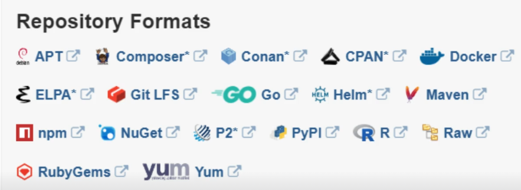

# 6. Artifact Repository Management with Nexus

## 0. Module Overview

In this module, we'll learn about artifact repositories and artifact repository managers.  

We'll set up one of the most popular artifact repo managers, Nexus, on a cloud server on DigitalOcean.  
We will then go through the most important features of Nexus:
- how to manage users and their permissions
- how to create different repositories for different artifact types
- the difference between components and assets

After setting up Nexus, we will publish a .jar file (Java app artifact) to a Maven repo on Nexus.  
First using Maven, and then using Gradle as a build tool.  

We'll also learn how to configure cleanup policies for our repositories, as well as how to talk to Nexus REST API.  

## 1. Intro to Artifact Repository Management

### Artifact Repository 

**Artifacts** are applications built into a single shareable and easily movable file.  
They can have different formats based on the language and the tools we use: .jar, .war, .zip, .tar, etc.  

An **artifact repository** = storage of those artifacts  
There are several types of artifact repositories, one for each artifact type.  

If your company builds different applications, one in Python and another one in Java, they'll need separate artifact repositories, because the artifact type will be different.  

### Artifact Repository Manager

Fortunately, we don't have to use multiple artifact repository managers depending on the artifact type.  
We can use a single artifact repository manager for all our artifact types.  

>[!important]
>An artifact repository is often abbreviated as **artifactory**.  

One of the most popular artifact repository managers is **Nexus**.  
Nexus acts as a central hub for storing and fetching all yourartifacts.  

**Nexus** is an artifactory manager that you would use internally in a company, it's for **private** use.  

There are also **public** artifactory managers, such as :
- Docker Hub, 
- Maven Central, 
- npm registry, 
- PyPI, 
- etc.  

### Private repo hosting AND Public repo proxy

On Nexus, you can host your own private repositories. It can be a Maven repo, a Dockerfile repo, an npm repo, etc.  
This way, you can share the application artifacts that are built within your company.  

But you can also set up a **proxy** on Nexus, and then fetch artifacts from **public** repositories through that proxy.  

To make it clear:
- When you deploy a private artifact, Nexus stores it in its internal storage
- When you fetch an artifact, Nexus either:
  - serves it from one of your private repositories, 
  - or routes/proxies the request to some upstream public repository, and then **caches** the response

This versatility makes Nexus very convenient because it allows us to manage all our artifacts in one spot.  

Nexus is available in two forms: open-source and commercial.  

Here's a sample of supported formats on Nexus:  
  

